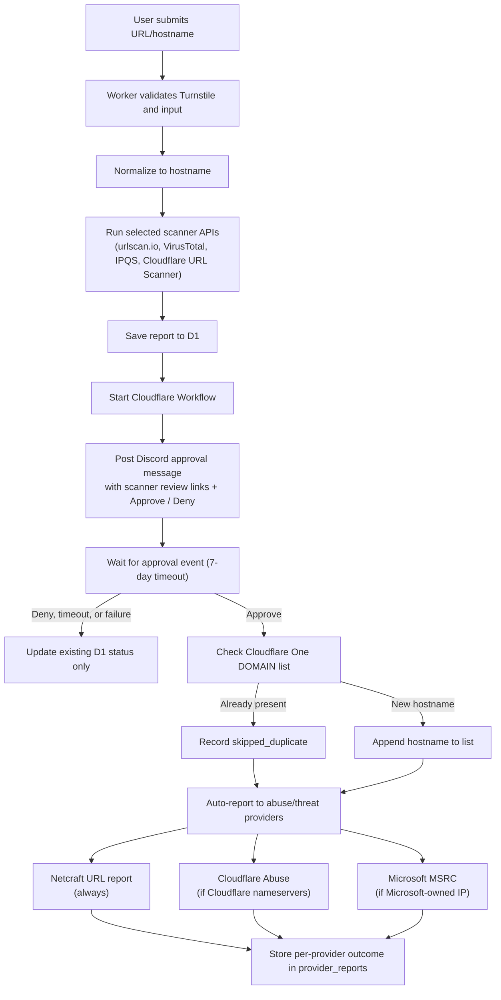

# Phishing Submission Collector

A simple tool built on the [Cloudflare Developer Platform](https://developers.cloudflare.com/products/?product-group=Developer+platform) to collect and analyze phishing submissions using various APIs for enhanced threat detection, reporting, and storage.

## How It Works

The application has two connected flows: public report submission and human approval for adding hostnames to a Cloudflare One Gateway list.

1. A user submits a URL or hostname through `public/index.html`.
2. The Worker verifies the Turnstile token and normalizes the submission to a hostname, for example `https://Login.Bad.Example/path` becomes `login.bad.example`.
3. The selected scanner APIs run in parallel for enrichment: urlscan.io, VirusTotal, IPQualityScore, and Cloudflare URL Scanner. The reporter chooses these per submission in the **Analysis Services** panel (urlscan.io, VirusTotal, and Cloudflare URL Scanner are on by default; IPQualityScore is off).
4. The report is saved to D1 before any approval action is requested.
5. The Worker starts the `PHISHING_HOSTNAME_WORKFLOW` Cloudflare Workflow.
6. The Workflow sends a formatted Discord message with scanner review links and **Approve** / **Deny** buttons.
7. Discord posts button clicks to `/discord/interactions`. The Worker verifies Discord's request signature and sends a Workflow event.
8. If denied, expired, or failed, the already-saved D1 report remains in place and the Workflow only updates D1 status fields.
9. If approved, the Workflow checks the configured Cloudflare One `DOMAIN` list.
10. If the hostname is already present, the Workflow records `skipped_duplicate`. Otherwise it appends the hostname and records `added`.
11. After the list write, the Workflow auto-reports the URL to external abuse/threat providers — **Netcraft** (always), **Cloudflare Abuse** (only when the domain uses Cloudflare nameservers), and **Microsoft MSRC** (only when the hostname resolves to a Microsoft-owned IP) — each as its own retryable step, recording every outcome in `provider_reports`.

After a successful submission the result panel also surfaces a prominent **Report to Google Safe Browsing** call-to-action, because Google has no automated submission API (see [Scanner & Reporting APIs](#scanner--reporting-apis)).



## Components

| Component | Role |
|---|---|
| Cloudflare Workers | Serves static assets, handles `/submit`, `/api/report/:id`, and `/discord/interactions`. |
| Cloudflare Static Assets | Serves files from `public/`. |
| Cloudflare Turnstile | Bot protection for public submissions. |
| Cloudflare D1 | Stores reports, scanner results, approval status, Workflow instance ID, and Cloudflare One list status. |
| Cloudflare Workflows | Durable human-in-the-loop process that waits for approval and retries external writes. |
| Discord App/Bot | Posts approval messages and sends signed button interactions back to the Worker. |
| Cloudflare One Gateway Lists | Stores approved phishing hostnames in the list configured by `CLOUDFLARE_GATEWAY_HOSTNAME_LIST_NAME`. |
| Scanner APIs (enrichment) | Submission-time enrichment from urlscan.io, VirusTotal, IPQualityScore, and Cloudflare URL Scanner. |
| Reporting providers (post-approval) | Abuse/threat submissions to Netcraft, Cloudflare Abuse, and Microsoft MSRC after approval. |

## Project Structure

```
project/
│
├── src/
│   ├── index.ts                # Worker routes and Workflow class
│   ├── approval.ts             # Discord approval and Cloudflare One list logic
│   ├── provider-reporting.ts   # Post-approval provider abuse reporting
│   ├── abuse-contacts.ts       # Submission-time registrar/host abuse-contact lookup
│   ├── rdap.ts                 # Shared DoH + RDAP primitives (used by the two above)
│   ├── hostname.ts             # URL/domain normalization and validation
│   └── shared.ts               # Shared HTTP/Worker helpers (headers, body, errors)
│
├── migrations/                 # Canonical D1 schema (wrangler d1 migrations)
│   ├── 0001_baseline.sql       # Consolidated, idempotent baseline schema
│   ├── 0002_drop_provider_reports_status_index.sql
│   └── 0003_add_approval_error.sql   # Dedicated approval_error column
│
├── databases/                  # Historical SQL, superseded by migrations/
│   ├── 001_create_table.sql
│   ├── 002_seed_data.sql       # Optional: test data for development (still used)
│   ├── 003_drop_unused_indexes.sql
│   ├── 004_add_hostname_approval.sql
│   └── 005_add_provider_reporting.sql
│
├── public/
│   ├── index.html              # Submission form
│   ├── report.html             # Reporting resources & status lookup
│   ├── manifest.json           # PWA manifest
│   ├── favicon.*               # Favicons
│   ├── _headers                # Static-asset response headers (CSP, etc.)
│   └── assets/
│       ├── scripts.js          # Submission form scripts (form, Turnstile, theme sync)
│       ├── report.js           # Status-lookup page script
│       ├── theme.js            # Dark/light theme bootstrap + themechange event
│       └── styles.css          # Frontend stylesheet
│
├── tests/                      # Vitest suites (run in workerd)
│   ├── *.test.ts               # approval, hostname, provider-reporting, abuse-contacts, index
│   ├── apply-migrations.ts     # Setup file: applies D1 migrations to the test database
│   └── tsconfig.json           # Test-only TS config
│
├── wrangler.jsonc              # Cloudflare Workers configuration (prod + staging env)
├── vitest.config.mts           # Workers test pool configuration
└── .dev.vars.example           # Template for local secrets (copy to .dev.vars)
```

## Scanner & Reporting APIs

This project uses external APIs in two distinct phases.

### 1. Submission-time enrichment (runs immediately, before approval)

These scan/analyze the URL and store reference IDs on the report. The reporter chooses which to run per submission in the **Analysis Services** panel on the form (urlscan.io, VirusTotal, and Cloudflare URL Scanner are enabled by default; IPQualityScore is off by default):

- [urlscan.io API v1](https://urlscan.io/docs/api/)
- [VirusTotal API v3](https://docs.virustotal.com/reference/overview)
- [IPQualityScore Malicious URL Scanner](https://www.ipqualityscore.com/documentation/malicious-url-scanner-api/overview)
- [Cloudflare URL Scanner API](https://developers.cloudflare.com/radar/investigate/url-scanner/)

### 2. Post-approval abuse/threat reporting (runs only after Discord approval)

After a hostname is approved, the Workflow submits abuse reports and records each outcome in `provider_reports`. Each provider is an independent, retryable Workflow step:

- **Netcraft URL reporting API** — submitted for every approved report.
- **Cloudflare Abuse Reports API** — submitted only when a Cloudflare DoH `NS` lookup finds Cloudflare nameservers (`*.ns.cloudflare.com`) for the domain; otherwise recorded as `skipped`.
- **Microsoft MSRC Abuse API** — submitted only when Cloudflare DoH resolution plus IP RDAP ownership lookup identify a Microsoft-owned IP (`microsoft`/`msft`/`azure`); otherwise recorded as `skipped`.

Google Safe Browsing reporting is **not** automated here because URL submission requires Google Cloud Web Risk Submission API access. Instead, after a successful submission the result panel shows a prominent **Report to Google Safe Browsing** button that opens Google's report form pre-filled with the submitted URL, so the reporter can finish that step in one click.

### Registrar / host abuse contacts (submission-time, reporter-driven)

At submission time the Worker also performs a best-effort RDAP lookup (`src/abuse-contacts.ts`, built on the shared `src/rdap.ts` primitives) to discover the **registrar abuse contact** (from domain RDAP) and the **hosting/network abuse contact** (from the resolved IP's RDAP). Each is the RDAP entity whose `roles` include `"abuse"`, with the email taken from its vCard and **validated for format** before use. When found, the result panel renders a secondary **Notify the provider abuse contacts** call-to-action with pre-filled `mailto:` links, so the reporter can escalate directly to the host/registrar (often the fastest path to takedown). The lookup is timeboxed and never blocks or fails the submission; contacts are display-only and not persisted.

## Configuration

### Secrets (per-environment, set via dashboard or `wrangler secret put`)

These are accessed at runtime as `env.<NAME>` and never appear in `wrangler.jsonc`:

```
URLSCAN_API_KEY="<YOUR_API_KEY_HERE>"
VIRUSTOTAL_API_KEY="<YOUR_API_KEY_HERE>"
IPQS_API_KEY="<YOUR_API_KEY_HERE>"
REPORTER_EMAIL="<YOUR_ABUSE_REPORT_CONTACT_EMAIL>"
# Optional provider reporting identity/config:
REPORTER_ORG="<YOUR_ORGANIZATION>"
REPORTER_COUNTRY="US"
REPORTER_PHONE="<YOUR_CONTACT_PHONE>"
NETCRAFT_SOURCE_UUID="<OPTIONAL_NETCRAFT_SOURCE_UUID>"
CLOUDFLARE_ACCOUNT_ID="<YOUR_CLOUDFLARE_ACCOUNT_ID>"
CLOUDFLARE_API_TOKEN="<API_TOKEN_WITH_ACCOUNT_URL_SCANNER_EDIT_ZERO_TRUST_LIST_AND_ABUSE_REPORT_ACCESS>"
TURNSTILE_SECRET_KEY="<YOUR_TURNSTILE_SECRET_KEY>"
DISCORD_APPLICATION_PUBLIC_KEY="<YOUR_DISCORD_APP_PUBLIC_KEY>"
DISCORD_BOT_TOKEN="<YOUR_DISCORD_BOT_TOKEN>"
DISCORD_APPROVAL_CHANNEL_ID="<YOUR_DISCORD_CHANNEL_ID>"
```

To upload a secret to a deployed Worker:

```
npx wrangler secret put <KEY>
```

See [Cloudflare Workers Secrets](https://developers.cloudflare.com/workers/configuration/secrets/) for details.

### Public vars (declared in `wrangler.jsonc` `vars`)

These should be pinned to the exact production origin and hostname.

| Var | Purpose | Example |
|---|---|---|
| `ALLOWED_ORIGINS` | Comma-separated CORS allowlist for `/submit` and `/api/report/`. | `https://report.example.com` |
| `TURNSTILE_EXPECTED_HOSTNAMES` | Comma-separated allowlist for the `hostname` returned by Turnstile Siteverify. | `report.example.com` |
| `CLOUDFLARE_GATEWAY_HOSTNAME_LIST_NAME` | Exact Cloudflare One Gateway `DOMAIN` list name to append approved hostnames to. | `0_PHISHING_Hostnames` |
| `REPORTER_NAME` | Reporter display name included in provider abuse submissions. | `PRIVATE` |

### Discord approval flow

The Cloudflare One hostname approval flow uses a Discord app/bot message with native **Approve** and **Deny** buttons.

1. Create a Discord app, add a bot, and invite it to the approval server/channel with permission to send messages.
2. Set the app's **Interactions Endpoint URL** to:
   ```
   https://<your-worker-hostname>/discord/interactions
   ```
3. Set the Discord secrets above via `wrangler secret put`.

After a report is stored in D1, the Worker starts the `PHISHING_HOSTNAME_WORKFLOW` Workflow. Approval adds the exact normalized hostname to the Cloudflare One `DOMAIN` list configured by `CLOUDFLARE_GATEWAY_HOSTNAME_LIST_NAME`; denial or timeout only updates the existing D1 row.

The Discord approval message includes the report ID, submitted URL, normalized hostname, category, source, description, and review links. When available, it links directly to the Cloudflare URL Scanner, urlscan.io, and VirusTotal reports; otherwise it includes a Cloudflare URL Scanner search/scan link for the submitted URL. Link previews are suppressed to keep the approval message compact. (Post-approval provider reporting is covered under [Scanner & Reporting APIs](#scanner--reporting-apis).)

Discord validates the Interactions Endpoint URL by sending a signed `PING` request. If validation fails:

- Confirm `DISCORD_APPLICATION_PUBLIC_KEY` is the Public Key from the same Discord app.
- Confirm the latest Worker is deployed.
- Confirm Cloudflare WAF/Custom Rules do not block `POST /discord/interactions`. If needed, add a narrowly scoped skip rule for this route.
- Check logs with `npx wrangler tail --config wrangler.jsonc --format=pretty`.

Discord setup details:

| Secret | What it is | Where to get it |
|---|---|---|
| `DISCORD_APPLICATION_PUBLIC_KEY` | Public key Discord uses to sign interaction requests. The Worker uses it to verify `/discord/interactions`. | Discord Developer Portal → your application → **General Information** → **Public Key**. |
| `DISCORD_BOT_TOKEN` | Bot token used by the Workflow to post the approval message with buttons into Discord. Treat it like a password. | Discord Developer Portal → your application → **Bot** → **Reset Token** / **Copy Token**. See the bot token flow in the referenced Discord bot guide. |
| `DISCORD_APPROVAL_CHANNEL_ID` | Numeric ID of the Discord channel where approval messages should be posted. | In Discord, enable **User Settings** → **Advanced** → **Developer Mode**, then right-click the target channel → **Copy Channel ID**. |

The bot must be invited to the server and must have permission to view the channel and send messages. The Discord app's Interactions Endpoint URL must point to the deployed Worker route `/discord/interactions`, otherwise button clicks will not reach the Workflow.

### Cloudflare One hostname list update

The approved hostname is added to a Cloudflare One Zero Trust list, not to WAF custom lists.

Required setup:

- Create or use a Zero Trust list, for example `0_PHISHING_Hostnames`.
- The list type must be `DOMAIN`, which Cloudflare One uses for hostnames/domains.
- Set `CLOUDFLARE_GATEWAY_HOSTNAME_LIST_NAME` in `wrangler.jsonc` to the exact list name.
- The API token in `CLOUDFLARE_API_TOKEN` needs access to read and edit Zero Trust lists. If Cloudflare URL Scanner is enabled on the form, the same token also needs `Account` > `URL Scanner` > `Edit`.

The Worker finds the list with:

```
GET /accounts/{account_id}/gateway/lists?type=DOMAIN
```

Then appends one item with the verified Cloudflare API endpoint:

```
PATCH /accounts/{account_id}/gateway/lists/{list_id}
{
  "append": [
    {
      "value": "login.bad.example",
      "description": "Report <report-id>"
    }
  ]
}
```

This matches Cloudflare's current **Patch Zero Trust list** API, where `append` adds list items and `remove` removes item values.

Duplicate handling:

- Existing hostnames are detected before the `PATCH` request.
- Duplicates do not update the Cloudflare One list again.
- D1 records `cloudflare_list_status = 'skipped_duplicate'`.
- Workers logs include `cloudflare_one_list_duplicate`.

## App Security

- **Cloudflare Turnstile** — required to submit. The sitekey is set as `data-sitekey` on `#turnstile-container` in [public/index.html](public/index.html); the secret is verified server-side with HTTP `response.ok` checking, a shared idempotency key reused across one bounded retry (on `5xx`/network errors), a 5 s timeout via `AbortSignal.timeout()`, response-shape validation, strict action validation (`submit-report`), and hostname validation (`TURNSTILE_EXPECTED_HOSTNAMES`). All five Turnstile callbacks (`callback`, `expired-callback`, `error-callback`, `timeout-callback`, `unsupported-callback`) are wired with retry/reset logic.
- **CORS** — exact-origin allowlist driven by `ALLOWED_ORIGINS` with a `Vary: Origin` header. Same-origin requests are always allowed.
- **Security response headers** — every response carries `X-Content-Type-Options: nosniff`, `Referrer-Policy: strict-origin-when-cross-origin`, `X-Frame-Options: DENY`, `Strict-Transport-Security`, and a restrictive `Permissions-Policy`. Static pages get their `Content-Security-Policy` from `public/_headers` (authoritative under asset-first routing); the submission page (`/`) needs no `style-src 'unsafe-inline'`, while `/report` keeps it for its inline `<style>`/`style=""`. The Turnstile script/iframe are allowed only where needed. All CSPs set `object-src 'none'` and `upgrade-insecure-requests`.
- **Body size guard** — `/submit` rejects declared or streamed bodies over 50,000 bytes (`413`).
- **Input validation** — server-side URL/domain parsing normalizes the exact hostname, rejects IPs/localhost/wildcards/invalid labels, and keeps category and source restricted to fixed enums.
- **D1 prepared statements** — all reads/writes use `?` placeholders; reads validate UUIDv4 format before querying; transient D1 write failures are retried with bounded jittered backoff.

## Accessibility & UX

- Honors `prefers-reduced-motion: reduce` (disables decorative animations on both pages).
- Honors `prefers-color-scheme: dark` (full dark palette on `index.html` and `report.html`). A manual theme toggle persists the choice in `localStorage`, sets `<meta name="theme-color">`, and dispatches a `themechange` event; the Turnstile widget (`size: 'flexible'`) re-renders to match the active theme live, with no page reload.
- Keyboard accessible: visible `:focus-visible` rings throughout; the custom analysis-service checkboxes stay in the tab order; on a failed submit, focus moves to the first invalid field; on success, focus moves to the result panel.
- ARIA roles on alerts; fields use `aria-describedby`/`aria-invalid`; decorative SVGs and emoji marked `aria-hidden="true"`; a `<noscript>` notice explains that JavaScript is required to submit.

## Local Development

1. Clone this repository.
2. Install [wrangler](https://developers.cloudflare.com/workers/wrangler/install-and-update/) (already a dev dependency: `npm install`).
3. Pick a secrets strategy:

   **Option A — use dashboard secrets directly (no local file needed):**
   ```
   npm run dev -- --remote
   ```

   **Option B — local-only secrets:** copy [.dev.vars.example](.dev.vars.example) to `.dev.vars` (gitignored), fill in values, then:
   ```
   npm run dev
   ```

4. Open <http://localhost:8787/>.

For deployment guidance, see the [Workers static assets docs](https://developers.cloudflare.com/workers/static-assets/get-started/#deploy-a-full-stack-application).

```
npm run deploy
```

`wrangler.jsonc` disables `workers.dev`; keep the production Custom Domain or route attached in Cloudflare, or add it to `wrangler.jsonc` with `routes` once the zone ownership details are confirmed.

### Staging deployment

The `staging` Wrangler environment deploys to `https://report-staging.automatic-demo.com/` with its own Worker name, D1 database, Workflow, CORS origin, Turnstile hostname, and Cloudflare One list name.

Set staging secrets separately from production:

```
npx wrangler secret put <KEY> --env staging
```

Deploy staging:

```
npm run deploy:staging
```

### Verifying a deployment

Both public origins sit behind Cloudflare edge protection, so a freshly deployed Worker is **not** reachable with anonymous tools like `curl`:

- **Staging** (`report-staging.automatic-demo.com`) is behind **Cloudflare Access** (intentionally internal) — unauthenticated requests get a `302` to the Access login.
- **Production** (`report.automatic-demo.com`) is fronted by a **WAF/firewall custom rule** that returns `403` to automated requests; real browsers pass.

Confirm a deploy via the control plane — `npx wrangler deployments list` (add `--env staging` for staging) plus D1 queries (`npx wrangler d1 migrations list … --remote`) — or load the site in an allowed/authenticated browser. Note that `POST /discord/interactions` must be allowed through (an Access bypass / WAF skip rule), because Discord cannot authenticate through Access.

## D1 Reports Database

Create the D1 database:

```
npx wrangler d1 create reports_db
```

Apply the schema with the [D1 migrations framework](https://developers.cloudflare.com/d1/reference/migrations/) (`migrations_dir` is configured per database in `wrangler.jsonc`). The baseline migration is idempotent, so this is safe both on a fresh database (it creates everything) and on an existing database that already had the historical `databases/*.sql` applied manually (it records the migrations without altering existing tables):

```
npx wrangler d1 migrations apply reports_db --remote
```

For the staging database:

```
npx wrangler d1 migrations apply reports_db_staging --remote --env staging
```

Use `--local` instead of `--remote` to target the local dev database, and `npx wrangler d1 migrations list reports_db --remote` to preview pending migrations.

(Optional) Seed test data:

```
npx wrangler d1 execute reports_db --remote --file ./databases/002_seed_data.sql
```

Validate the setup (table is `reports_v2`):

```
npx wrangler d1 execute reports_db --remote --command="SELECT id, name, category, timestamp FROM reports_v2 ORDER BY timestamp DESC LIMIT 5"
```

### Managing schema updates

Schema changes use the migrations framework. Create a migration, edit the generated file in `migrations/`, then apply it:

```
npx wrangler d1 migrations create reports_db "add_new_column"
npx wrangler d1 migrations apply reports_db --remote
```

`migrations/0001_baseline.sql` is the consolidated current schema and `migrations/0002_*` drops an unused index. The historical `databases/*.sql` files are kept for reference only and are superseded by `migrations/`.

## Endpoints

The same Worker code and route table are deployed to two environments, distinguished only by hostname:

| Environment | Base URL |
|---|---|
| Production | `https://report.automatic-demo.com` |
| Staging | `https://report-staging.automatic-demo.com` |

Both sit behind edge protection (see [Verifying a deployment](#verifying-a-deployment)). All paths below exist on both base URLs:

| Method | Path | Purpose | Access / auth |
|---|---|---|---|
| `POST` | `/submit` | Submit a URL/domain for analysis and start the approval Workflow. JSON body. | Public; gated by Turnstile token + CORS origin allowlist. |
| `GET` | `/api/report/:id` | Look up a stored report by UUIDv4. Returns a minimal public projection (no PII/internal fields). | Public by UUID; CORS origin allowlist. |
| `POST` | `/discord/interactions` | Receives Discord button clicks (Approve/Deny) and the validation `PING`; forwards the decision to the Workflow. | Verified via Discord Ed25519 request signature. Must be allowed past Access/WAF (Discord cannot authenticate). |
| `OPTIONS` | `/submit`, `/api/report/:id` | CORS preflight. | `204` for allowed origins, `403` otherwise. |
| `GET` | `/`, `/report`, `/*` | Static assets from `./public/` via the `ASSETS` binding (submission form, reporting directory, JS/CSS, icons). | Public (behind the environment's edge protection). |

> Note: there is no separate API base path for the Discord setup — point the Discord app's **Interactions Endpoint URL** at `https://<base-url>/discord/interactions` for whichever environment you are configuring.

## Testing

### Automated checks

```
npm run test
npm run check
npm run deploy:dry-run
```

Tests are written in TypeScript and run inside the Workers runtime (workerd) via [`@cloudflare/vitest-pool-workers`](https://developers.cloudflare.com/workers/testing/vitest-integration/), using the bindings declared in `wrangler.jsonc` (see `vitest.config.mts`). `tests/index.test.ts` exercises the real `fetch` handler through `SELF`. The project's D1 migrations are applied to the ephemeral test database (via `tests/apply-migrations.ts`), so read-path tests run against the real schema — `index.test.ts` seeds a row and reads it back through `/api/report/:id`, guarding the read projection against schema drift.

### End-to-end approval flow

Run the full flow against a deployed Worker or a public tunnel. Discord cannot call a private localhost URL.

1. Confirm setup:
   - D1 migrations are applied (`npx wrangler d1 migrations apply reports_db --remote`).
   - Required secrets are set.
   - Discord Interactions Endpoint URL is `https://<worker-hostname>/discord/interactions`.
   - A Zero Trust `DOMAIN` list exists with the exact name configured in `CLOUDFLARE_GATEWAY_HOSTNAME_LIST_NAME`.
2. Submit a fresh hostname through the browser form so Turnstile issues a real token.
3. Confirm D1 has the saved pending report:
   ```
   npx wrangler d1 execute reports_db --remote --command="SELECT id, normalized_hostname, workflow_instance_id, approval_status, cloudflare_list_status FROM reports_v2 WHERE id = '<REPORT_ID>'"
   ```
4. Click **Deny** in Discord. Re-run the query and expect `approval_status = 'denied'` and `cloudflare_list_status = 'not_started'`.
5. Submit a second fresh hostname and click **Approve**. Re-run the query and expect `approval_status = 'approved'` and `cloudflare_list_status = 'added'` or `skipped_duplicate`.
6. Verify the Cloudflare One list contains the approved hostname:
   ```
   curl -H "Authorization: Bearer $CLOUDFLARE_API_TOKEN" "https://api.cloudflare.com/client/v4/accounts/$CLOUDFLARE_ACCOUNT_ID/gateway/lists?type=DOMAIN"
   curl -H "Authorization: Bearer $CLOUDFLARE_API_TOKEN" "https://api.cloudflare.com/client/v4/accounts/$CLOUDFLARE_ACCOUNT_ID/gateway/lists/<LIST_ID>/items"
   ```
7. Confirm provider reporting rows exist:
   ```
   npx wrangler d1 execute reports_db --remote --command="SELECT provider, status, eligibility_reason, reference_id FROM provider_reports WHERE report_id = '<REPORT_ID>'"
   ```
8. Watch operational logs:
   ```
   npx wrangler tail --config wrangler.jsonc --format=pretty
   ```

Useful log events:

| Event | Meaning |
|---|---|
| `discord_interaction_verification_failed` | Discord signature validation failed; check public key, route, and WAF/Custom Rules. |
| `cloudflare_one_list_hostname_added` | Hostname was appended to the Gateway list. |
| `cloudflare_one_list_duplicate` | Hostname already existed; no list write was attempted. |
| `provider_reporting_step_failed` | A provider step failed after retries; that provider is recorded as `failed`. |
| `provider_reporting_db_error` | Provider results were produced but could not be persisted to D1. |

## Reporting Entities

The report page ([public/report.html](public/report.html)) is the canonical, regularly-updated directory of reporting destinations (browsers, URL analysis tools, malware analysis, security services, regional CERTs, email-provider phishing reports). Live preview: <https://report.automatic-demo.com/report.html>.

Its **Check Report Status** view (which looks up a report by ID via `/api/report/:id`) shows the Discord approval and Cloudflare One blocklist status, and ends with a call-to-action prompting the reporter to also report the URL directly to Google Safe Browsing (pre-filled) and to the hosting/registrar abuse contacts — the fastest paths to takedown.

## Known Limitations / Future Work

- **Workflow approval observability** — approval status is stored in D1, but there is no admin dashboard yet for pending/expired approvals.
- **`/api/report/:id` is publicly readable by UUID** — acceptable given UUIDv4 entropy, but no auth. It returns a minimal projection: internal/PII fields (`approval_actor`, `workflow_instance_id`, `cloudflare_list_error`, and provider `response_json`) are not exposed.
- **Rate limiting** — deploy should include a Cloudflare Rate Limiting Rule for `/submit`; keep this outside app code when possible.
- **Additional reporting providers** — candidates for new post-approval Workflow steps include abuse.ch URLhaus, the APWG eCrime eXchange, PhishTank, and Spamhaus. Google Web Risk Submission API would replace the manual Google CTA if access is granted. (RDAP-derived registrar/host abuse contacts are already surfaced to the reporter at submission time — see [Scanner & Reporting APIs](#scanner--reporting-apis); a future step could optionally *auto-email* them after approval rather than leaving it reporter-driven.)
- **Discord approval flow enhancements** — richer embeds showing inline scanner verdicts/risk scores, a Deny-reason modal, approver role/RBAC restrictions, editing the original message in place with the final outcome (added/duplicate + per-provider results), pre-expiry reminder pings, and a slash command to look up report status from Discord.

## Disclaimer

This project is intended for educational purposes only and is provided "as-is" without any guarantees.

- **Independence:** This repository is neither affiliated with nor endorsed by any of the APIs, entities, or organizations mentioned.
- **Use Responsibly:** Always adhere to the terms of service for any APIs and ensure compliance with local laws when handling sensitive or potentially malicious data.
- **Liability:** The repository owners are not responsible for misuse or consequences arising from the use of this tool.

For more information, consult the documentation of the respective APIs and legal guidelines for reporting phishing or malicious activities.
